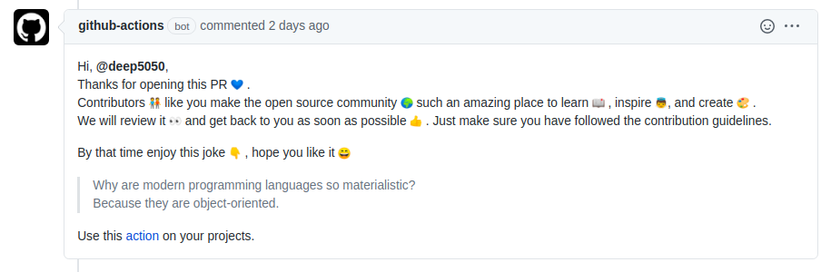

<!-- ALL-CONTRIBUTORS-BADGE:START - Do not remove or modify this section -->

[](#contributors-)

<!-- ALL-CONTRIBUTORS-BADGE:END -->

<!-- PROJECT LOGO -->
<br />
<p align="center">
  <a href="https://github.com/deep5050/MastJokeMara">
    
  </a>

  <p align="center">

<br />
  <a href="https://github.com/deep5050/MastJokeMara/graphs/contributors">
  
  </a>
  <a href="https://github.com/deep5050/MastJokeMara/network/members">
  
  </a>
  <a href="https://github.com/deep5050/MastJokeMara/stargazers">
  
  </a>
  <a href="https://github.com/deep5050/MastJokeMara/issues">
  
  </a>
  <a href="https://github.com/deep5050/MastJokeMara/blob/master/LICENSE.txt">
  
  </a>
  <!-- <a href="https://linkedin.com/in/othneildrew">
  
  </a> -->
        <br/><a href="https://github.com/marketplace/actions/mast-joke-mara"><strong>See it on Marketplace »</strong></a>
    <br />
    <!-- <br /> -->
    <a href="https://github.com/deep5050/MastJokeMara/issues/37">View Demo</a>
    ·
    <a href="https://github.com/deep5050/MastJokeMara/issues">Report Bug</a>
    ·
    <a href="https://github.com/deep5050/MastJokeMara/issues">Request Feature</a>
  </p>
</p>

## [Subscribe to receive updates](https://github.com/deep5050/MastJokeMara/issues/52)

## Table of Contents

- [About the Project](#about-the-project)
  - [Built With](#built-with)
- [Getting Started](#getting-started)
- [Usage](#usage)
- [Roadmap](#roadmap)
- [Version History](#version-history)
- [Contributing](#contributing)
- [Support](#support)
- [License](#license)
- [Contact](#contact)
- [Related Works](#related-works)

## About The Project

This workflow comments on a new issue or pull request by a lovely greeting and
with a complimentary joke. For now it supports only programming jokes only, It
will support more jokes soon.

> On new Issues


> On new Pull Requests



### Built With

- [@actions/toolkit](https://github.com/actions/toolkit)
- [JokeAPI](https://github.com/Sv443/JokeAPI)

## Getting Started

Any public or private repository can run this workflow by copying
[greet_with_joke.yml](./greet_with_joke.yml) file to their `.github/workflows`
directory.

<!-- USAGE EXAMPLES -->

## Usage

> Default configuration

```yaml
name: "Greet With A Random Joke"
on:
  issues:
    types: [opened, reopened]
  pull_request_target:
    types: [opened, reopened]

jobs:
  test:
    name: setup environment
    runs-on: ubuntu-latest
    steps:
      - name: mast joke mara
        uses: deep5050/MastJokeMara@main
        with:
          GITHUB_TOKEN: ${{ secrets.GITHUB_TOKEN }}
```

> Custom configuration [NEW]

```yaml
name: "Greet With A Random Joke"
on:
  issues:
    types: [opened, reopened]
  pull_request_target:
    types: [opened, reopened]

jobs:
  test:
    name: setup environment
    runs-on: ubuntu-latest
    steps:
      - name: mast joke mara
        uses: deep5050/MastJokeMara@main
        with:
          GITHUB_TOKEN: ${{ secrets.GITHUB_TOKEN }}
          issue_msg: |
            Hi, {{author}} here is a joke for you
            {{joke}}
```

When using Custom configuration **DO NOT** forget to include `{{author}}` and
`{{joke}}`

## Roadmap

See the [open issues](https://github.com/deep5050/MastJokeMara/issues) for a
list of proposed features (and known issues).

## Version History

`v1.4.0` [Fork-PR support] Added support for fork-based PRs.

`v1.3.0` [Custom message support] Added support for custom Issue and PR messages

`v1.2.0` [Avoid issues raised by bot or owner] : Avoids issues/PRs raised by a
bot or the owner himself. Also run only on issue or Pull Request opened and
reopened events.

`v1.1.0` [Avoid bots] : Avoids replying to the bot comments

`v1.0.0` [Initial release] : Supports programming jokes

<!-- CONTRIBUTING -->

## Contributing

Contributions are what make the open source community such an amazing place to
be learn, inspire, and create. Any contributions you make are **greatly
appreciated**.

1. Fork the Project
2. Create your Feature Branch
3. Commit your Changes
4. Push to the Branch
5. Test by raising an issue or a PR on your own branch
6. Open a Pull Request

> **DO NOT** make any changes to `dist/index.js` as it is automgically generated
> from `index.js` by vercel-ncc module.

> Any changes made on `index.js` MUST be reflected on `dist/index.js` too as the
> workflow runs the `dist/index.js` NOT `index.js` on root.

> **Run `npm run prepare`** before you push any changes made on `index.js`

## Support

All Kinds Of Supports Are Welcome :raised_hands:! The Most Basic Way To Show
Your Support Is To Star :star2: The Project, Or To Raise Issues :speech_balloon:
You Can Also Support This Project By
[**becoming a sponsor on GitHub**](https://github.com/sponsors/deep5050) :clap:
Or By Making A [**Paypal**](https://paypal.me/deep5050) Donation :)

<!-- LICENSE -->

## License

Distributed under the MIT License. See `LICENSE` for more information.

<!-- CONTACT -->

## Contact

Dipankar Pal - dipankarpal5050@gmail.com

## Related Works

[NaughtyLust](https://github.com/deep5050/NaughtyLust) : Awesome Nautilus
Scripts For Linux.

[qikQR](https://github.com/deep5050/qikQR) : Minimal QR Code Generator App Made
With Electron.

[cppcheck-action](https://github.com/deep5050/cppcheck-action) : Check Security
Flaws In Your C/C++ Codes Right From GitHub Action Workflows.

[autopy-lot](https://github.com/deep5050/autopy-lot) : GitHub Action Setup To
Convert Jupyter Notebooks To Python Scripts And Markdowns.

<div align=center>
<p align=center>
</p>
<p align=center>Happy Coding</p>

<p align=center>  </p>

</div>

> [participate on the poll for new features](https://github.com/deep5050/MastJokeMara/issues/50)

Want more jokes on categories like `Programming` `Miscellaneous` `Dark` `Pun`

[](https://api.gh-polls.com/poll/01EN73BKJD66AZ4EK0BWKRQ0H3/YES/vote)

[](https://api.gh-polls.com/poll/01EN73BKJD66AZ4EK0BWKRQ0H3/NO/vote)

[](https://api.gh-polls.com/poll/01EN73BKJD66AZ4EK0BWKRQ0H3/MAYBE/vote)

## Contributors ✨

Thanks goes to these wonderful people
([emoji key](https://allcontributors.org/docs/en/emoji-key)):

<!-- ALL-CONTRIBUTORS-LIST:START - Do not remove or modify this section -->
<!-- prettier-ignore-start -->
<!-- markdownlint-disable -->
<table>
  <tr>
    <td align="center"><a href="https://github.com/krazy4code"><br /><sub><b>Krazy 4 Code </b></sub></a><br /><a href="https://github.com/deep5050/MastJokeMara/issues?q=author%3Akrazy4code" title="Bug reports">🐛</a></td>
  </tr>
</table>

<!-- markdownlint-enable -->
<!-- prettier-ignore-end -->

<!-- ALL-CONTRIBUTORS-LIST:END -->

This project follows the
[all-contributors](https://github.com/all-contributors/all-contributors)
specification. Contributions of any kind welcome!
